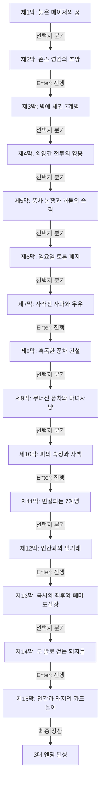

# 《동물농장》 — 이야기 구조 및 철학 설계서 (1-1단계)

> **원작**: 이상적 혁명이 부패하여 독재로 변질되는 조지 오웰의 서늘한 정치 풍자극  
> **난이도 등급**: `medium` (중간 (중고등 도서 권장))  
> **총 막/씬 수**: 15개 막 완결  
> **고유 메트릭**: **`비판적 양심`** 🚩 (0 ~ 10, 기본값: 3)

---

## 1. 팩 핵심 서사 철학 및 메타데이터

* **제목**: 동물농장
* **분류**: 중간 (중고등 도서 권장)
* **핵심 철학**: 이상적 혁명이 부패하여 독재로 변질되는 조지 오웰의 서늘한 정치 풍자극
* **메트릭 규칙**: 양심과 성찰에 부합하는 선택 시 +1~+3, 나태·굴복·독재·외면 시 -1~-3

---

## 2. 머메이드 서사 구조도 (Scene Graph & Flow)

---

## 3. 엔딩 3대 성향 분석 (Ending Profiles)

| 엔딩 명칭 | 최소 메트릭 | 설명 |
|---|:---:|---|
| **깨어있는 역사의 감시자** | 16 | 어떤 권력의 거짓 선동과 공포 앞에서도 비판적 이성과 양심을 지켜내어 역사의 진실을 증언했습니다. |
| **고뇌하는 농장의 관찰자** | 10 | 권력의 타락을 목격하며 이상과 현실 사이에서 깊은 슬픔과 회한을 삼켰습니다. |
| **침묵에 순응한 자** | -99 | 독재의 채찍과 거짓말 앞에 스스로 생각하기를 멈추고 멍에를 멨습니다. |
