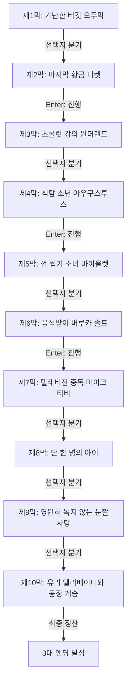

# 《찰리와 초콜릿 공장》 — 이야기 구조 및 철학 설계서 (1-1단계)

> **원작**: 황금 티켓과 달콤한 교훈이 가득한 윌리 웡카의 공장 모험  
> **난이도 등급**: `easy` (쉬움 (초등 도서 권장))  
> **총 막/씬 수**: 10개 막 완결  
> **고유 메트릭**: **`순수함의 황금`** 🍫 (0 ~ 10, 기본값: 3)

---

## 1. 팩 핵심 서사 철학 및 메타데이터

* **제목**: 찰리와 초콜릿 공장
* **분류**: 쉬움 (초등 도서 권장)
* **핵심 철학**: 황금 티켓과 달콤한 교훈이 가득한 윌리 웡카의 공장 모험
* **메트릭 규칙**: 양심과 성찰에 부합하는 선택 시 +1~+3, 나태·굴복·독재·외면 시 -1~-3

---

## 2. 머메이드 서사 구조도 (Scene Graph & Flow)

---

## 3. 엔딩 3대 성향 분석 (Ending Profiles)

| 엔딩 명칭 | 최소 메트릭 | 설명 |
|---|:---:|---|
| **초콜릿 제국의 위대한 후계자** | 8 | 온갖 탐욕과 유혹을 순수한 양심으로 물리치고, 윌리 웡카의 모든 유산과 마법을 물려받아 세상에 행복을 선물했습니다. |
| **정직한 공장의 소년** | 5 | 가난 속에서도 가족을 사랑하고 예의를 지켜 웡카 공장의 따뜻한 보금자리를 얻었습니다. |
| **달콤한 꿈을 꾼 아이** | -99 | 비록 위대한 후계자가 되진 못했으나 평생 잊지 못할 달콤한 교훈을 얻었습니다. |
