# 《단테의 신곡: 지옥·연옥·천국》 — 이야기 구조 및 철학 설계서 (1-1단계)

> **원작**: 지옥의 심연에서 연옥의 정화를 거쳐 천국의 삼위일체 사랑에 도달하는 20막 대서사시  
> **난이도 등급**: `hard` (어려움 (성인 문학 권장))  
> **총 막/씬 수**: 20개 막 완결  
> **고유 메트릭**: **`신성한 은총의 빛`** ☀️ (0 ~ 10, 기본값: 3)

---

## 1. 팩 핵심 서사 철학 및 메타데이터

* **제목**: 단테의 신곡: 지옥·연옥·천국
* **분류**: 어려움 (성인 문학 권장)
* **핵심 철학**: 지옥의 심연에서 연옥의 정화를 거쳐 천국의 삼위일체 사랑에 도달하는 20막 대서사시
* **메트릭 규칙**: 양심과 성찰에 부합하는 선택 시 +1~+3, 나태·굴복·독재·외면 시 -1~-3

---

## 2. 머메이드 서사 구조도 (Scene Graph & Flow)

```mermaid
graph TD
    S1["제1막: 지옥편 1  어두운 숲과 베르길리우스"]
    S1 -->|"선택지 분기"| S2
    S2["제2막: 지옥편 2  아케론 강의 뱃사공 카론"]
    S2 -->|"Enter: 진행"| S3
    S3["제3막: 지옥편 3  애욕의 암흑 폭풍과 프란체스카"]
    S3 -->|"선택지 분기"| S4
    S4["제4막: 지옥편 4  불타는 석관의 파리나타"]
    S4 -->|"Enter: 진행"| S5
    S5["제5막: 지옥편 5  끓는 피의 강 플레게톤"]
    S5 -->|"Enter: 진행"| S6
    S6["제6막: 지옥편 6  말레볼제 지옥 뱀의 고통"]
    S6 -->|"Enter: 진행"| S7
    S7["제7막: 지옥편 7  얼음 호수 코키토스와 탈출"]
    S7 -->|"선택지 분기"| S8
    S8["제8막: 연옥편 1  카토와 정화의 해변"]
    S8 -->|"선택지 분기"| S9
    S9["제9막: 연옥편 2  천사의 나룻배와 영혼들"]
    S9 -->|"Enter: 진행"| S10
    S10["제10막: 연옥편 3  연옥의 문과 일곱 개의 P"]
    S10 -->|"선택지 분기"| S11
    S11["제11막: 연옥편 4  제1제단 거대한 바위를 진 교만"]
    S11 -->|"선택지 분기"| S12
    S12["제12막: 연옥편 5  제5제단 바닥에 엎드린 탐욕"]
    S12 -->|"Enter: 진행"| S13
    S13["제13막: 연옥편 6  제7제단 순결의 불꽃 벽"]
    S13 -->|"선택지 분기"| S14
    S14["제14막: 연옥편 7  지상낙원과 베아트리체의 강림"]
    S14 -->|"선택지 분기"| S15
    S15["제15막: 천국편 1  월구(Moon) 서원의 미완"]
    S15 -->|"선택지 분기"| S16
    S16["제16막: 천국편 2  태양구(Sun) 지혜의 빛과 아퀴나스"]
    S16 -->|"Enter: 진행"| S17
    S17["제17막: 천국편 3  화성구(Mars) 신앙의 십자가와 조상"]
    S17 -->|"선택지 분기"| S18
    S18["제18막: 천국편 4  토성구(Saturn) 관조의 황금 사다리"]
    S18 -->|"Enter: 진행"| S19
    S19["제19막: 천국편 5  엠피레오(Empyrean) 순백의 천상 장미"]
    S19 -->|"선택지 분기"| S20
    S20["제20막: 천국편 6  지고의 환희와 삼위일체의 빛"]
    S20 -->|"최종 정산"| END["3대 엔딩 달성"]
```

---

## 3. 엔딩 3대 성향 분석 (Ending Profiles)

| 엔딩 명칭 | 최소 메트릭 | 설명 |
|---|:---:|---|
| **천상의 빛과 합일한 성스러운 대시인** | 22 | 지옥의 형벌, 연옥의 정화, 천국의 삼위일체 신비를 모두 관통하여 우주를 움직이는 영원한 사랑과 하나가 되었습니다. |
| **연옥을 넘어선 순례자** | 14 | 죄악의 무거운 짐을 벗어던지고 베아트리체의 인도를 받아 천상의 문턱에 도달했습니다. |
| **지옥을 목격한 방랑자** | -99 | 인간 영혼의 깊은 죄악과 고통을 뼈에 새기며 지상에서의 새로운 참회를 다짐했습니다. |
