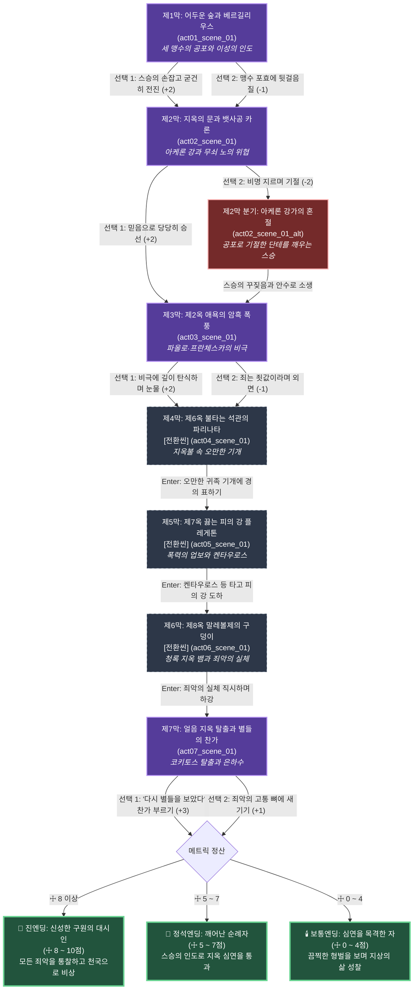

# 《단테의 신곡: 지옥편》 — 이야기 구조 및 철학 설계 (1-1/4 Story Structure)

> **문서 목적**: 단테 알리기에리 불멸의 고전 《신곡: 지옥편》의 신학·철학적 고뇌와 9대 지옥 순례를 콘솔 서사 구조도로 완벽 정립  
> **서사 타입**: `linear_pilgrimage` (선형 영혼 순례기)  
> **총 장/막**: 7개 막 (지옥의 7대 핵심 권역 선정 및 울트라 픽셀 컷씬 연동)  
> **총 씬 수**: 8개 씬 (7개 정식 씬 + 1개 아케론 강 심연 대체 씬)

---

## 1. 팩 핵심 서사 철학 및 메타데이터

| 항목 | 설정값 | 철학적 의미 및 게임적 해석 |
|:---|:---|:---|
| **팩 ID** | `dante_inferno` | 단테 알리기에리(Dante Alighieri)의 불멸의 대서사시 |
| **제목** | 단테의 신곡: 지옥편 | 부제: 어두운 숲에서 얼음 호수 코키토스를 지나 별들을 향한 순례 |
| **핵심 수치 (Metric)** | **`이성과 영혼의 빛 (Reason & Grace)`** ☩ | 0 ~ 10 (기본값: 3) — 맹목적 공포와 죄악의 유혹을 이겨내고 스승(이성)의 인도를 따라 신성한 은총으로 나아가는 영혼의 정화도 |
| **원작 서사 철학** | **"지옥의 가장 참혹한 심연을 통과해 본 자만이, 밤하늘의 영원한 별빛을 우러러볼 수 있다"** | 죄의 본질(애욕, 오만, 폭력, 기만)을 직시하되 인간적 비극에 연민을 느끼고, 끝내 이성의 지혜로 영혼을 구원하는 대서사적 참회록. |
| **수치 변화 규칙** | 굴복/기절/냉담: -1~-2, 용기/연민/기개/찬가: +2~+3 | 8 이상 도달 시 '신성한 구원의 대시인' 진엔딩 |
| **힌트 시스템 ([0] 키)** | **`[💡 지혜의 사색 노트]`** | 각 지옥의 죄질과 형벌에 얽힌 토마스 아퀴나스적 신학 윤리 성찰 제공 |

---

## 2. 막(Chapter) 및 암호(Password) 체계

| 막 (Act) | 막 이름 | 씬 ID | 암호 | 지옥 권역 및 핵심 테마 |
|:---:|:---|:---|:---:|:---|
| **제1막** | 어두운 숲과 베르길리우스 | `act01_scene_01` | `숲길` | 인생의 반환점에서 마주친 세 맹수와 스승 베르길리우스(이성)의 출현 |
| **제2막** | 지옥의 문과 뱃사공 카론 | `act02_scene_01` | `아케론` | "모든 희망을 버려라", 핏빛 강물과 숯불 눈을 번뜩이는 카론의 나룻배 |
| **제3막** | 제2옥: 애욕의 암흑 폭풍 | `act03_scene_01` | `프란체스카` | 영원한 회오리바람 속에서 서로를 안고 우는 파올로와 프란체스카의 비극 |
| **제4막** | 제6옥: 불타는 석관의 파리나타 | `act04_scene_01` (전환) | `불석관` | 지옥 화염 속에서도 꺾이지 않는 피렌체 귀족 파리나타의 거대한 기개 |
| **제5막** | 제7옥: 끓는 피의 강 플레게톤 | `act05_scene_01` (전환) | `피의강` | 폭군들이 잠긴 펄펄 끓는 피의 강과 켄타우로스 네소스의 활시위 |
| **제6막** | 제8옥: 말레볼제의 구덩이 | `act06_scene_01` (전환) | `지옥뱀` | 도둑과 사기꾼의 살점을 물어뜯어 재로 만드는 거대한 청록색 지옥 뱀 |
| **제7막** | 얼음 지옥 탈출과 별들의 찬가 | `act07_scene_01` (엔딩) | `별빛` | 거인 루시퍼를 딛고 지옥을 탈출하여 밤하늘 은하수를 마주한 대찬가 |
| *(분기)* | 아케론 강의 기절 | `act02_scene_01_alt` | - | 제2막에서 공포에 질려 기절했을 때 스승의 부축으로 깨어나는 성찰 씬 |

---

## 3. 머메이드 서사 구조도 (Mermaid Story Flow & Scene Graph)

---

## 4. 엔딩 3대 성향 분석 (Ending Profiles)

| 엔딩 등급 | 엔딩 명칭 | 최소 메트릭 | 칭호 및 신학적 성찰 해석 |
|:---|:---|:---:|:---|
| **최고 엔딩 (진엔딩)** | **신성한 구원의 대시인** | ☩ 8 ~ 10 | **"지옥의 모든 죄악과 고통을 이성과 연민으로 통찰하고, 별들이 빛나는 구원의 길로 나아간 지혜의 대시인"** |
| **정석 엔딩** | **깨어난 순례자** | ☩ 5 ~ 7 | **"공포와 절망을 극복하고 스승 베르길리우스의 인도를 따라 지옥의 심연을 무사히 통과한 순례자"** |
| **성찰 엔딩** | **심연을 목격한 자** | ☩ 0 ~ 4 | **"지옥의 끔찍한 형벌을 목격하고 뼈에 새기며 지상에서의 새로운 삶과 절제를 다짐한 방랑자"** |
