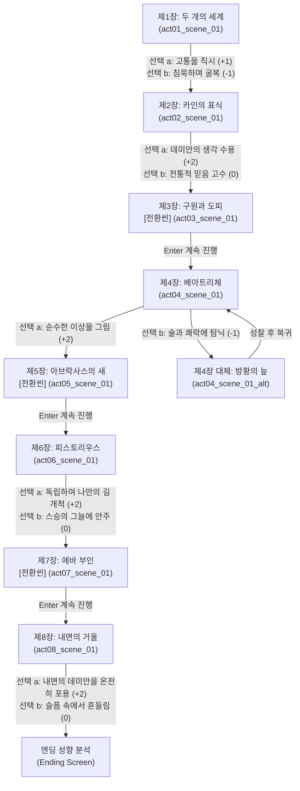

# 데미안 (Demian) — 이야기 구조 설계 (1-1/4 Story Structure)

> **문서 목적**: 원작 《데미안》의 방대한 서사를 78컬럼 5영역 터미널 카드 팩으로 옮기기 위한 **서사 구조도(Scene Graph & Chapter Layout)** 수립  
> **서사 타입**: `growth` (내면 성장형 분기 구조)  
> **총 장/막**: 8개 장 (원작 8장 1:1 매핑)  
> **총 씬 수**: 9개 씬 (8개 정식 씬 + 1개 방황/성찰 대체 씬)  

---

## 1. 팩 핵심 메타데이터 설계

| 항목 | 설정값 | 설명 |
|------|--------|------|
| **팩 ID** | `demian` | 헤르만 헤세의 대표 성장 명작 |
| **제목** | 데미안 (Demian) | 부제: 에밀 싱클레어의 젊은 시절의 이야기 |
| **핵심 수치 (Metric)** | `자아의 빛` (`Light of Self`) ✧ | 0 ~ 10 (내면의 각성도, 스스로의 길을 걷는 용기) |
| **수치 변화 규칙** | 타협/도피: -1~0, 직시/각성: +1~+2 | 7 이상 도달 시 '아브락사스의 날개' 진엔딩 |
| **문체 (Tones)** | `casual` (현대 소설체) / `classic` (헤세 원문 문학체) | 깊이 있는 사색과 내면 독백을 살린 어조 |
| **실패 전략 (Failure)** | `scene_retry` (회환의 성찰 후 현재 장 재도전) | 두려움에 굴복했을 때 내면의 음성이 깨우쳐 줌 |

---

## 2. 장(Chapter) 및 암호(Password) 체계

| 장 (Act) | 장 이름 (Chapter Name) | 씬 ID | 암호 (Password) | 핵심 테마 |
|:---:|-------------------|--------|:---:|-----------|
| **제1장** | 두 개의 세계 | `act01_scene_01` | `세계` | 안락한 질서와 어두운 유혹의 경계 |
| **제2장** | 카인의 표식 | `act02_scene_01` | `카인` | 맹목적 도덕에 대한 의문과 비범한 시선 |
| **제3장** | 구원과 도피 | `act03_scene_01` (전환) | `해방` | 공포로부터의 구원, 그리고 부모 품으로의 도피 |
| **제4장** | 베아트리체 | `act04_scene_01` | `동경` | 방황의 늪에서 피어난 이상형의 초상화 |
| **제5장** | 아브락사스의 새 | `act05_scene_01` (전환) | `알` | 알을 깨고 신에게로 날아가는 투쟁 |
| **제6장** | 피스토리우스 | `act06_scene_01` | `불꽃` | 스승과의 대화, 그리고 홀로서기의 결단 |
| **제7장** | 에바 부인 | `act07_scene_01` (전환) | `어머니` | 영혼의 모태이자 모든 사랑의 총체 |
| **제8장** | 내면의 거울 | `act08_scene_01` (엔딩) | `거울` | 상실을 넘어 내면에서 완성된 영원한 자아 |
| *(분기)* | 방황의 늪 | `act04_scene_01_alt` | - | 베아트리체를 외면하고 환락에 침잠했을 때 |

---

## 3. 씬 그래프 (Scene Graph & Branch Flow)

---

## 4. 엔딩 3대 분기 조건 (Ending Profiles)

| 엔딩 ID | 엔딩 명칭 | 최소 수치 | 획득 칭호 및 성향 해석 |
|---------|-----------|:---:|------------------------|
| `ending_a` | **아브락사스의 날개** | ✧ 8 ~ 10 | **"알을 깨고 신에게 도달한 온전한 자아"** 타인의 도덕에 휘둘리지 않고 선과 악을 모두 품어 진정한 자기 자신이 된 초인 |
| `ending_b` | **사색하는 방랑자** | ✧ 4 ~ 7 | **"빛과 어둠의 경계에서 끊임없이 묻는 자"** 세상의 질서와 내면의 목소리 사이에서 고뇌하며 천천히 걸어가는 구도자 |
| `ending_c` | **껍질 속의 안식** | ✧ 0 ~ 3 | **"알을 깨지 못하고 밝은 세계로 돌아간 자"** 자유의 고통보다 질서의 안락함을 택해 어머니의 품으로 회귀한 영혼 |

---

## 5. 인물 구성 (Characters)

* **주인공 (Protagonist)**: 에밀 싱클레어 (`♧`, 선과 악의 경계에서 방황하며 성장하는 소년)
* **인도자 (Antagonist / Mentor)**: 막스 데미안 (`✦`, 카인의 표식을 지닌 비범한 영혼의 이끄는 자)
* **조력자 (Support Characters)**:
  * 프란츠 크로머 (`☠`, 어두운 세계의 불량배이자 최초의 공포)
  * 피스토리우스 (`♬`, 교회 오르간 연주자이자 내면의 불꽃을 지피는 스승)
  * 에바 부인 (`♥`, 데미안의 어머니이자 모든 갈망의 종착지인 대모신)
  * 내면의 목소리 (`─`, 방황의 순간마다 울리는 자아의 나침반)
