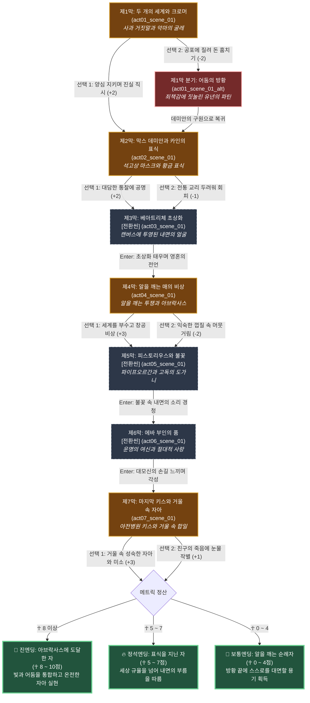

# 《데미안》 — 이야기 구조 및 철학 설계 (1-1/4 Story Structure)

> **문서 목적**: 헤르만 헤세의 걸작 《데미안》의 실존주의 철학("알을 깨고 나오는 투쟁")을 콘솔 5영역 및 296x152 울트라 픽셀 엔진에 맞춘 **서사 구조도(Scene Graph & Branch Flow)**로 수립  
> **서사 타입**: `linear_awakening` (자아 각성 순례기)  
> **총 장/막**: 7개 막 (원작의 핵심 마디 7막 완결)  
> **총 씬 수**: 8개 씬 (7개 정식 씬 + 1개 내면 방황 대체 씬)

---

## 1. 팩 핵심 서사 철학 및 메타데이터

| 항목 | 설정값 | 철학적 의미 및 게임적 해석 |
|:---|:---|:---|
| **팩 ID** | `demian` | 헤르만 헤세(Hermann Hesse) 대표 실존주의 성장 소설 |
| **제목** | 데미안 | 부제: 에밀 싱클레어의 유년 시절의 붕괴와 참 자아로의 비상 |
| **핵심 수치 (Metric)** | **`내면의 각성 (Awakening & Self)`** ☥ | 0 ~ 10 (기본값: 3) — 외부의 규율과 거짓을 깨뜨리고 내면의 불멸하는 신성을 향해 나아가는 독립성의 척도 |
| **원작 서사 철학** | **"새는 알에서 나오려고 투쟁한다. 알은 세계다. 태어나려는 자는 하나의 세계를 깨뜨려야 한다. 신의 이름은 아브락사스다."** | 밝은 세계(가족, 규율, 선)의 안온함을 부수고, 어두운 세계(욕망, 고독, 악)까지 포용하여 온전한 '자기 자신'이 되는 고결한 투쟁. |
| **수치 변화 규칙** | 굴복/의존/도피: -1~-2, 통찰/투쟁/각성/자립: +2~+3 | 8 이상 도달 시 '아브락사스에 도달한 자' 진엔딩 |
| **힌트 시스템 ([0] 키)** | **`[💡 지혜의 사색 노트]`** | 각 막마다 융(Jung) 심리학과 카인의 표식, 내면의 신성에 대한 깊은 철학 노트 제공 |

---

## 2. 막(Chapter) 및 암호(Password) 체계

| 막 (Act) | 막 이름 | 씬 ID | 암호 | 자아 실현 단계 및 핵심 테마 |
|:---:|:---|:---|:---:|:---|
| **제1막** | 두 개의 세계와 크로머 | `act01_scene_01` | `사과` | 거짓말의 굴레, 밝은 부모의 세계 뒤편에 도사린 악마 크로머의 협박 |
| **제2막** | 막스 데미안과 카인의 표식 | `act02_scene_01` | `카인` | 맹목적 도덕의 붕괴, 비범한 영혼들에게 깃든 '카인의 표식' 전수 |
| **제3막** | 베아트리체 초상화 | `act03_scene_01` (전환) | `초상화` | 외부의 연인을 향한 갈망이 결국 내면의 데미안(참 자아)임을 발견 |
| **제4막** | 알을 깨는 매의 비상 | `act04_scene_01` | `아브락사스` | 껍질의 파괴, 선과 악을 통합한 신 아브락사스를 향한 맹금류의 비상 |
| **제5막** | 피스토리우스와 불꽃 | `act05_scene_01` (전환) | `불꽃` | 오르간 선율과 타오르는 불꽃, 스승의 그늘마저 딛고 서는 절대적 고독 |
| **제6막** | 에바 부인의 품 | `act06_scene_01` (전환) | `에바부인` | 모든 어머니이자 연인의 원형, 애원이 아닌 확신에서 차오르는 참된 사랑 |
| **제7막** | 마지막 키스와 거울 속 자아 | `act07_scene_01` (엔딩) | `거울` | 1차 대전 야전병원, 데미안과의 합일 및 거울 속에 완성된 참 자아 |
| *(분기)* | 어둠의 방황 | `act01_scene_01_alt` | - | 제1막에서 죄책감에 굴복해 서랍을 털다 발각되어 방황하는 성찰 씬 |

---

## 3. 머메이드 서사 구조도 (Mermaid Story Flow & Scene Graph)

---

## 4. 엔딩 3대 성향 분석 (Ending Profiles)

| 엔딩 등급 | 엔딩 명칭 | 최소 메트릭 | 칭호 및 실존주의 심리학 해석 |
|:---|:---|:---:|:---|
| **최고 엔딩 (진엔딩)** | **아브락사스에 도달한 자** | ☥ 8 ~ 10 | **"빛과 어둠의 양 세계를 온전히 통합하고, 스스로의 껍질을 깨부수어 신(아브락사스)과 합일한 위대한 각성자"** |
| **정석 엔딩** | **표식을 지닌 자 (카인의 후예)** | ☥ 5 ~ 7 | **"세상의 맹목적 규율에 굴복하지 않고 내면의 부름을 따르는 고결하고 용기 있는 영혼의 소유자"** |
| **성찰 엔딩** | **알을 깨는 순례자** | ☥ 0 ~ 4 | **"수많은 방황과 고통을 겪었으나 마침내 거짓의 가면을 벗고 자기 자신을 대면할 용기를 얻은 순례자"** |
