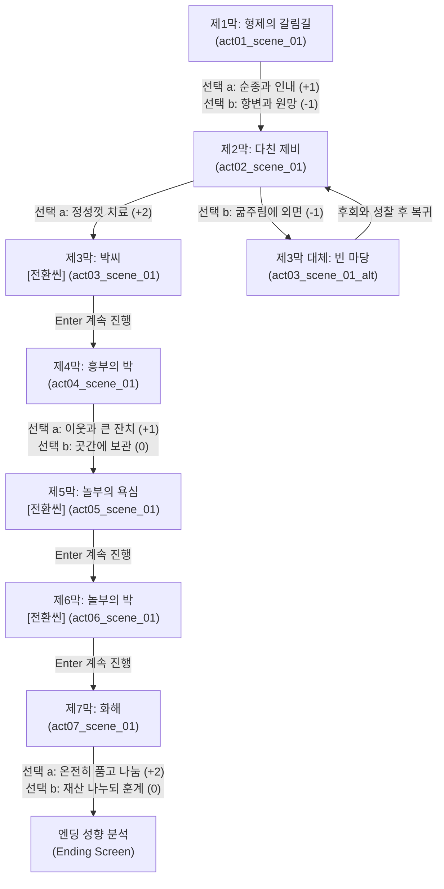

# 흥부놀부전 — 이야기 구조 설계 (1-1/4 Story Structure)

> **문서 목적**: 원작 《흥부놀부전》의 서사를 78컬럼 5영역 터미널 카드 팩으로 옮기기 위한 **서사 구조도(Scene Graph & Chapter Layout)** 수립  
> **서사 타입**: `linear` (선형 서사 구조)  
> **총 장/막**: 7개 막 (원작 주요 마디 7막 완결)  
> **총 씬 수**: 8개 씬 (7개 정식 씬 + 1개 대체 씬)  

---

## 1. 팩 핵심 메타데이터 설계

| 항목 | 설정값 | 설명 |
|------|--------|------|
| **팩 ID** | `heungbu_nolbu` | 한국 대표 고전 설화 / 판소리계 소설 |
| **제목** | 흥부놀부전 | 부제: 형제의 갈림길과 보은의 박 |
| **핵심 수치 (Metric)** | `선행의 씨앗` (`Seeds of Virtue`) ♧ | 0 ~ 10 (선행과 인내, 이웃 나눔의 척도, 기본값: 3) |
| **수치 변화 규칙** | 이기적/원망: -1, 자비/선행/용서: +1~+2 | 7 이상 도달 시 '형제의 봄' 대화해 진엔딩 |
| **문체 (Tones)** | `casual` (현대 구어체) / `classic` (고전 판소리체) | 판소리 사설의 운율과 해학을 살린 어조 |
| **실패 전략 (Failure)** | `scene_retry` (수치 0 도달 시 현재 막 재도전) | 인정을 저버렸을 때 화자의 교훈과 함께 성찰 기회 제공 |

---

## 2. 막(Chapter) 및 암호(Password) 체계

| 막 (Act) | 막 이름 (Chapter Name) | 씬 ID | 암호 (Password) | 핵심 테마 |
|:---:|-------------------|--------|:---:|-----------|
| **제1막** | 형제의 갈림길 | `act01_scene_01` | `형제` | 빈손으로 쫓겨나는 흥부, 인내와 원망의 기로 |
| **제2막** | 다친 제비 | `act02_scene_01` | `제비` | 구렁이의 습격과 작은 생명에 대한 자비 |
| **제3막** | 박씨 | `act03_scene_01` (전환) | `박씨` | 은혜를 잊지 않고 찾아온 제비의 보은 |
| **제4막** | 흥부의 박 | `act04_scene_01` | `금은보화` | 박을 타며 쏟아지는 보물과 이웃 나눔 |
| **제5막** | 놀부의 욕심 | `act05_scene_01` (전환) | `욕심` | 억지로 제비 다리를 부러뜨린 가짜 선행 |
| **제6막** | 놀부의 박 | `act06_scene_01` (전환) | `도깨비` | 터진 박에서 나온 도깨비와 빚쟁이 (인과응보) |
| **제7막** | 화해 | `act07_scene_01` (엔딩) | `우애` | 패망한 형을 품에 안고 재산을 나누는 진정한 우애 |
| *(분기)* | 빈 마당 | `act03_scene_01_alt` | - | 제2막에서 다친 제비를 외면했을 때의 대체 씬 |

---

## 3. 씬 그래프 (Scene Graph & Branch Flow)

---

## 4. 엔딩 3대 성향 분석 (Ending Profiles)

| 엔딩 ID | 엔딩 명칭 | 최소 수치 | 획득 칭호 및 성향 해석 |
|---------|-----------|:---:|------------------------|
| `ending_a` | **형제의 봄** | ♧ 7 ~ 10 | **"원망 대신 인내를 택하고 작은 생명을 품어 끝내 형제를 구원한 순례자"** |
| `ending_b` | **교훈의 가을** | ♧ 4 ~ 6 | **"옳고 그름 사이에서 고뇌하며 작은 선행의 씨앗을 틔운 사색가"** |
| `ending_c` | **시든 씨앗** | ♧ 0 ~ 3 | **"눈앞의 이익과 원망에 흔들려 선행의 싹을 틔우지 못한 방랑자"** |

---

## 5. 인물 구성 (Characters)

* **주인공 (Protagonist)**: 흥부 (`♧`, 가난 속에서도 착한 심성을 잃지 않는 아우)
* **적대자 (Antagonist)**: 놀부 (`凸`, 탐욕과 심술로 가득 찬 형)
* **조력자 (Support Characters)**:
  * 흥부 아내 (`○`, 고난을 함께 견디는 지혜로운 동반자)
  * 화자 (`─`, 판소리 사설로 서사를 이끄는 소리꾼)
  * 도깨비 (`鬼`, 인과응보의 징벌을 내리는 심판관)
  * 빚쟁이 (`₩`, 놀부의 가산을 청산하는 현실의 채권자)
