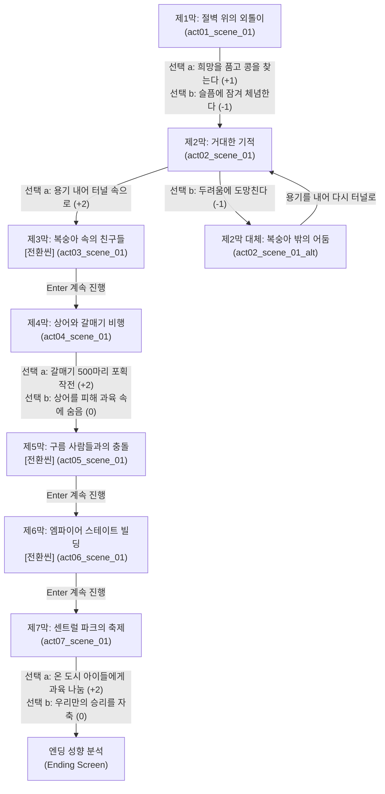

# 제임스와 슈퍼 복숭아 — 이야기 구조 설계 (1-1/4 Story Structure)

> **문서 목적**: 로알드 달 원작 《제임스와 슈퍼 복숭아》를 78x40 시네마틱 터미널 카드 팩으로 옮기기 위한 **서사 구조도(Scene Graph & Chapter Layout)** 수립  
> **서사 타입**: `linear` (선형 모험 서사 구조)  
> **총 장/막**: 7개 막 (원작 명장면 7막 완결)  
> **총 씬 수**: 8개 씬 (7개 정식 씬 + 1개 대체 분기 씬)  

---

## 1. 팩 핵심 메타데이터 설계

| 항목 | 설정값 | 설명 |
|------|--------|------|
| **팩 ID** | `james_peach` | 로알드 달 대표 환상 모험 명작 |
| **제목** | 제임스와 슈퍼 복숭아 | 원제: James and the Giant Peach |
| **핵심 수치 (Metric)** | `모험의 용기` (`Courage & Wonder`) ★ | 0 ~ 10 (두려움을 이겨내는 용기와 기발한 상상력, 기본값: 3) |
| **수치 변화 규칙** | 겁먹음/포기: -1, 지혜/용기/우정/나눔: +1~+2 | 7 이상 도달 시 '하늘을 난 꿈' 대모험 진엔딩 |
| **문체 (Tones)** | `casual` (유쾌한 동화 구어체) / `classic` (클래식 영미 문학체) | 로알드 달 특유의 재치와 리듬감 있는 대화 |
| **실패 전략 (Failure)** | `scene_retry` (수치 0 도달 시 현재 막 재도전) | 두려움에 사로잡혔을 때 곤충 친구들의 격려와 함께 재도전 기회 제공 |

---

## 2. 막(Chapter) 및 암호(Password) 체계

| 막 (Act) | 막 이름 (Chapter Name) | 씬 ID | 암호 (Password) | 핵심 테마 |
|:---:|-------------------|--------|:---:|-----------|
| **제1막** | 절벽 위의 외톨이 | `act01_scene_01` | `초록콩` | 두 고모의 혹독한 구박과 노인이 건넨 마법의 씨앗 |
| **제2막** | 거대한 기적 | `act02_scene_01` | `슈퍼복숭아` | 끝없이 자라난 황금빛 복숭아 속 터널로의 탐험 |
| **제3막** | 복숭아 속의 친구들 | `act03_scene_01` (전환) | `곤충친구들` | 7마리 개성 넘치는 거대 곤충들과의 만남과 바다 출항 |
| **제4막** | 상어와 갈매기 비행 | `act04_scene_01` | `갈매기` | 상어 떼의 습격과 502마리 갈매기 밧줄 비행 작전 |
| **제5막** | 구름 사람들과의 충돌 | `act05_scene_01` (전환) | `우박` | 구름 위의 신비로운 공장과 우박 공격 탈출 |
| **제6막** | 엠파이어 스테이트 빌딩 | `act06_scene_01` (전환) | `뉴욕` | 뉴욕 상공 강하와 엠파이어 스테이트 빌딩 첨탑 착륙 |
| **제7막** | 센트럴 파크의 축제 | `act07_scene_01` (엔딩) | `대축제` | 복숭아 과육을 나누는 대축제와 영원한 우정 |
| *(분기)* | 복숭아 밖의 어둠 | `act02_scene_01_alt` | - | 제2막에서 복숭아 터널에 들어가지 않고 주저했을 때의 대체 씬 |

---

## 3. 씬 그래프 (Scene Graph & Branch Flow)

---

## 4. 엔딩 3대 성향 분석 (Ending Profiles)

| 엔딩 ID | 엔딩 명칭 | 최소 수치 | 획득 칭호 및 성향 해석 |
|---------|-----------|:---:|------------------------|
| `ending_a` | **하늘을 난 꿈** | ★ 7 ~ 10 | **"두려움의 절벽을 넘어 대양을 건너 세상 모든 아이들에게 경이로움을 선물한 위대한 모험가"** |
| `ending_b` | **구름 위의 항해가** | ★ 4 ~ 6 | **"곤충 친구들의 손을 잡고 미지의 하늘을 개척한 지혜로운 탐험가"** |
| `ending_c` | **외딴집의 방랑자** | ★ 0 ~ 3 | **"기적 앞에서도 의심과 불안에 흔들렸으나 끝내 소중한 친구를 얻은 사색가"** |

---

## 5. 인물 구성 (Characters)

* **주인공 (Protagonist)**: 제임스 (`★`, 맑은 영혼과 천재적인 기지를 가진 소년)
* **적대자 (Antagonist)**: 스파이커 & 스펀지 고모 (`☠`, 탐욕스럽고 잔인한 두 자매)
* **주요 곤충 친구들 (Support Characters)**:
  * 늙은 메뚜기 (`♪`, 신사다운 지혜와 바이올린 연주)
  * 지네 (`👟`, 수십 켤레 부츠를 신은 장난꾸러기 투덜이)
  * 무당벌레 (`🐞`, 온화하고 자애로운 어머니 같은 존재)
  * 미스 스파이더 (`🕸`, 정교한 거미줄을 짜는 든든한 기술자)
  * 지렁이 (`〰`, 눈이 안 보이지만 착하고 겁 많은 미끼 역)
  * 반딧불이 (`💡`, 밤하늘을 환히 밝혀주는 전등 역)
  * 누에 (`🧶`, 부드러운 명주실을 쉼 없이 자아내는 장인)
