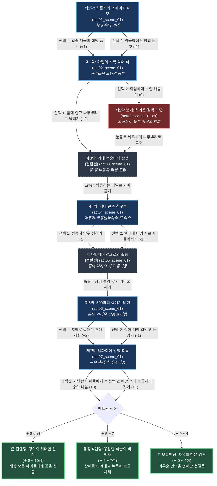

# 《제임스와 슈퍼 복숭아》 — 이야기 구조 및 철학 설계 (1-1/4 Story Structure)

> **문서 목적**: 로알드 달 원작의 서사 철학과 갈등 분기를 5영역 콘솔 및 296x152 울트라 픽셀 엔진에 맞춘 **서사 구조도(Scene Graph & Branch Flow)**로 정립  
> **서사 타입**: `linear_with_branch` (선형 모험극 및 내면 윤리 분기)  
> **총 장/막**: 7개 막 (전체 울트라 픽셀 컷씬 및 티키타카 대화 연동)  
> **총 씬 수**: 8개 씬 (7개 정식 씬 + 1개 대체 성찰 씬)

---

## 1. 팩 핵심 서사 철학 및 메타데이터

| 항목 | 설정값 | 철학적 의미 및 게임적 해석 |
|:---|:---|:---|
| **팩 ID** | `james_peach` | 로알드 달(Roald Dahl) 대표 환상 아동 문학 |
| **제목** | 제임스와 슈퍼 복숭아 | 부제: 거대 복숭아와 대서양 하늘을 가르는 기적의 항해 |
| **핵심 수치 (Metric)** | **`경이와 용기 (Wonder & Courage)`** ✦ | 0 ~ 10 (기본값: 3) — 학대의 절망을 딛고 미지의 기적을 믿으며 친구들과 연대하는 순수한 용기의 척도 |
| **원작 서사 철학** | **"학대와 결핍 속에서도 꺼지지 않는 순수한 희망과, 이질적인 존재들과의 따스한 연대"** | 세상의 편견(징그러운 거대 벌레들) 너머의 다정한 영혼을 알아보고, 얻은 기적의 결실을 혼자 독점하지 않고 세상의 굶주린 아이들과 나누는 삶의 태도. |
| **수치 변화 규칙** | 굴복/불신/패닉: -1, 경이/우정/지혜/나눔: +1~+3 | 8 이상 도달 시 '경이의 위대한 선장' 진엔딩 |
| **힌트 시스템 ([0] 키)** | **`[💡 지혜의 사색 노트]`** | 각 막마다 어른들의 탐욕과 공포를 이겨내는 동화적 성찰 메시지 제공 |

---

## 2. 막(Chapter) 및 암호(Password) 체계

| 막 (Act) | 막 이름 | 씬 ID | 암호 | 핵심 갈등 및 서사 마디 |
|:---:|:---|:---|:---:|:---|
| **제1막** | 스폰지와 스파이커 이모 | `act01_scene_01` | `이모들` | 채찍과 쇠지팡이의 가혹한 학대, 인내와 희망의 불씨 |
| **제2막** | 마법의 초록 악어 혀 | `act02_scene_01` | `악어혀` | 고목 뿌리 숲에서 건네받은 수천 마리 악어 혀의 형광 기적 |
| **제3막** | 거대 복숭아의 탄생 | `act03_scene_01` (전환) | `대복숭아` | 쿵-쿵 박동하는 슈퍼 복숭아와 어른들의 탐욕을 피해 터널 진입 |
| **제4막** | 거대 곤충 친구들 | `act04_scene_01` | `신사벌레` | 메뚜기·무당벌레·지네와의 첫 대면, 편견을 깬 진정한 우정 |
| **제5막** | 대서양으로의 출항 | `act05_scene_01` (전환) | `대서양` | 절벽을 박차고 굴러떨어져 대서양 파도를 가르는 자유의 출항 |
| **제6막** | 500마리 갈매기 비행 | `act06_scene_01` | `갈매기` | 상어 떼의 습격에 맞서 은빛 거미줄로 갈매기 편대를 엮은 창공 비행 |
| **제7막** | 엠파이어 빌딩 착륙 | `act07_scene_01` (엔딩) | `자유의땅` | 뉴욕 첨탑 착륙, 달콤한 복숭아를 세상 아이들과 나누는 대동축제 |
| *(분기)* | 차가운 절벽 마당 | `act02_scene_01_alt` | - | 제2막에서 노인의 마법 씨앗을 의심해 놓쳤을 때의 성찰 씬 |

---

## 3. 머메이드 서사 구조도 (Mermaid Story Flow & Scene Graph)

---

## 4. 엔딩 3대 성향 분석 (Ending Profiles)

| 엔딩 등급 | 엔딩 명칭 | 최소 메트릭 | 칭호 및 원작 철학적 해석 |
|:---|:---|:---:|:---|
| **최고 엔딩 (진엔딩)** | **경이의 위대한 선장** | ✦ 8 ~ 10 | **"가혹한 학대를 지혜와 용기로 이겨내고, 대서양을 건너 세상 모든 아이들에게 꿈과 달콤함을 선물한 위대한 선장"** |
| **정석 엔딩** | **용감한 하늘의 비행사** | ✦ 5 ~ 7 | **"친구들과 힘을 합쳐 상어와 절망을 이겨내고 뉴욕 마천루에 새로운 보금자리를 개척한 모험가"** |
| **성찰 엔딩** | **자유를 찾은 영혼** | ✦ 0 ~ 4 | **"두려움에 떨었으나 어두운 언덕을 탈출하여 마침내 스스로의 삶을 살아갈 기회를 얻은 순례자"** |
