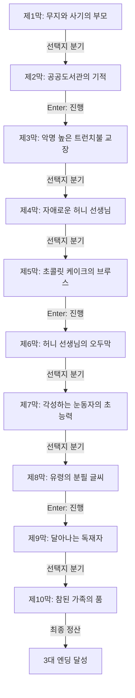

# 《마틸다》 — 이야기 구조 및 철학 설계서 (1-1단계)

> **원작**: 책을 사랑하는 천재 소녀 마틸다의 유쾌하고 통쾌한 정의 실현극  
> **난이도 등급**: `easy` (쉬움 (초등 도서 권장))  
> **총 막/씬 수**: 10개 막 완결  
> **고유 메트릭**: **`지혜와 정의`** 📖 (0 ~ 10, 기본값: 3)

---

## 1. 팩 핵심 서사 철학 및 메타데이터

* **제목**: 마틸다
* **분류**: 쉬움 (초등 도서 권장)
* **핵심 철학**: 책을 사랑하는 천재 소녀 마틸다의 유쾌하고 통쾌한 정의 실현극
* **메트릭 규칙**: 양심과 성찰에 부합하는 선택 시 +1~+3, 나태·굴복·독재·외면 시 -1~-3

---

## 2. 머메이드 서사 구조도 (Scene Graph & Flow)

---

## 3. 엔딩 3대 성향 분석 (Ending Profiles)

| 엔딩 명칭 | 최소 메트릭 | 설명 |
|---|:---:|---|
| **기적을 부르는 위대한 작은 거인** | 8 | 폭력과 무지에 굴복하지 않고 뛰어난 지성과 용기로 불의를 몰아내어, 가장 따스한 가족의 품에서 행복을 찾았습니다. |
| **용기 있는 책벌레 소녀** | 5 | 허니 선생님과 함께 부당한 교장을 물리치고 새로운 학교의 희망이 되었습니다. |
| **지혜의 싹을 틔운 아이** | -99 | 어두운 환경 속에서도 독서의 즐거움을 잃지 않고 스스로의 길을 열었습니다. |
