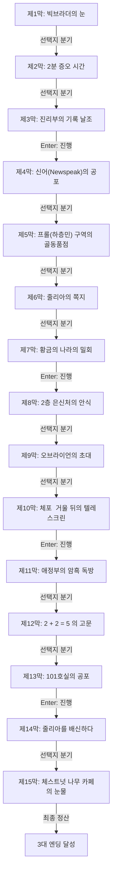

# 《1984》 — 이야기 구조 및 철학 설계서 (1-1단계)

> **원작**: 빅브라더의 감시와 언어 통제, 인간 영혼의 파괴를 경고한 디스토피아 문학의 정점  
> **난이도 등급**: `medium` (중간 (중고등 도서 권장))  
> **총 막/씬 수**: 15개 막 완결  
> **고유 메트릭**: **`인간성의 존엄`** 👁️ (0 ~ 10, 기본값: 3)

---

## 1. 팩 핵심 서사 철학 및 메타데이터

* **제목**: 1984
* **분류**: 중간 (중고등 도서 권장)
* **핵심 철학**: 빅브라더의 감시와 언어 통제, 인간 영혼의 파괴를 경고한 디스토피아 문학의 정점
* **메트릭 규칙**: 양심과 성찰에 부합하는 선택 시 +1~+3, 나태·굴복·독재·외면 시 -1~-3

---

## 2. 머메이드 서사 구조도 (Scene Graph & Flow)

---

## 3. 엔딩 3대 성향 분석 (Ending Profiles)

| 엔딩 명칭 | 최소 메트릭 | 설명 |
|---|:---:|---|
| **불멸하는 정신의 수호자** | 10 | 가혹한 고문과 세뇌 속에서도 2+2=4의 진실과 인간적 존엄의 불씨를 지켜낸 비극의 영웅입니다. |
| **고뇌하는 저항자** | 6 | 빅브라더의 거대한 폭력 앞에 육신은 꺾였으나, 마지막 순간까지 자유를 향한 눈물을 흘렸습니다. |
| **순응한 빅브라더의 신민** | -99 | 공포에 굴복하여 사랑하던 이를 배신하고, 마침내 감시자의 품에 안겨 자신을 잃어버렸습니다. |
