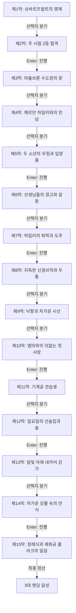

# 《수레바퀴 아래서》 — 이야기 구조 및 철학 설계서 (1-1단계)

> **원작**: 주입식 입시 교육과 어른들의 욕망에 희생된 섬세한 영혼의 비가  
> **난이도 등급**: `medium` (중간 (중고등 도서 권장))  
> **총 막/씬 수**: 15개 막 완결  
> **고유 메트릭**: **`영혼의 순수성`** 🌿 (0 ~ 10, 기본값: 3)

---

## 1. 팩 핵심 서사 철학 및 메타데이터

* **제목**: 수레바퀴 아래서
* **분류**: 중간 (중고등 도서 권장)
* **핵심 철학**: 주입식 입시 교육과 어른들의 욕망에 희생된 섬세한 영혼의 비가
* **메트릭 규칙**: 양심과 성찰에 부합하는 선택 시 +1~+3, 나태·굴복·독재·외면 시 -1~-3

---

## 2. 머메이드 서사 구조도 (Scene Graph & Flow)

---

## 3. 엔딩 3대 성향 분석 (Ending Profiles)

| 엔딩 명칭 | 최소 메트릭 | 설명 |
|---|:---:|---|
| **수레바퀴를 벗어난 자유로운 영혼** | 11 | 세속의 무거운 바퀴에 영혼을 짓밟히지 않고, 자연과 참된 우정의 가치를 끝내 기억한 순례자입니다. |
| **상처 입은 시인** | 7 | 가혹한 경쟁 사회 속에서 깊은 상처를 입었으나, 네카어 강의 평온 속에서 영원한 안식을 얻었습니다. |
| **짓밟힌 어린 영혼** | -99 | 어른들의 출세욕과 삭막한 규율의 수레바퀴에 갈려 피어보지도 못하고 스러졌습니다. |
