# 《차라투스트라는 이렇게 말했다》 — 이야기 구조 및 철학 설계서 (1-1단계)

> **원작**: 신이 죽은 시대, 낙타·사자·아이의 3대 변화를 거쳐 영원회귀와 위버멘쉬를 선언하는 니체의 철학시  
> **난이도 등급**: `hard` (어려움 (성인 문학 권장))  
> **총 막/씬 수**: 20개 막 완결  
> **고유 메트릭**: **`위버멘쉬의 불꽃`** 🦅 (0 ~ 10, 기본값: 3)

---

## 1. 팩 핵심 서사 철학 및 메타데이터

* **제목**: 차라투스트라는 이렇게 말했다
* **분류**: 어려움 (성인 문학 권장)
* **핵심 철학**: 신이 죽은 시대, 낙타·사자·아이의 3대 변화를 거쳐 영원회귀와 위버멘쉬를 선언하는 니체의 철학시
* **메트릭 규칙**: 양심과 성찰에 부합하는 선택 시 +1~+3, 나태·굴복·독재·외면 시 -1~-3

---

## 2. 머메이드 서사 구조도 (Scene Graph & Flow)

```mermaid
graph TD
    S1["제1막: 산에서 내려오는 현자"]
    S1 -->|"선택지 분기"| S2
    S2["제2막: 세 가지 변화  낙타, 사자, 아이"]
    S2 -->|"선택지 분기"| S3
    S3["제3막: 줄타기 광대의 추락"]
    S3 -->|"선택지 분기"| S4
    S4["제4막: 최후의 인간과 위버멘쉬"]
    S4 -->|"선택지 분기"| S5
    S5["제5막: 창백한 범죄자"]
    S5 -->|"Enter: 진행"| S6
    S6["제6막: 천 개의 목표와 하나의 목표"]
    S6 -->|"선택지 분기"| S7
    S7["제7막: 친구와 고독"]
    S7 -->|"선택지 분기"| S8
    S8["제8막: 시장터의 파리들"]
    S8 -->|"Enter: 진행"| S9
    S9["제9막: 환영과 수수께끼  영원회귀의 관문"]
    S9 -->|"선택지 분기"| S10
    S10["제10막: 목동과 검은 뱀"]
    S10 -->|"선택지 분기"| S11
    S11["제11막: 안식일의 고요한 시간"]
    S11 -->|"Enter: 진행"| S12
    S12["제12막: 낡은 서판과 새로운 서판"]
    S12 -->|"선택지 분기"| S13
    S13["제13막: 자발적인 거렁뱅이"]
    S13 -->|"Enter: 진행"| S14
    S14["제14막: 그림자의 탄식"]
    S14 -->|"선택지 분기"| S15
    S15["제15막: 가장 추악한 인간의 고백"]
    S15 -->|"Enter: 진행"| S16
    S16["제16막: 동굴 속의 보다 높은 인간들"]
    S16 -->|"선택지 분기"| S17
    S17["제17막: 나귀 축제와 어린아이의 유희"]
    S17 -->|"선택지 분기"| S18
    S18["제18막: 한밤중의 방랑자의 노래"]
    S18 -->|"선택지 분기"| S19
    S19["제19막: 황금빛 사자와 비둘기 떼"]
    S19 -->|"Enter: 진행"| S20
    S20["제20막: 아침놀과 대단원  위버멘쉬의 태양"]
    S20 -->|"최종 정산"| END["3대 엔딩 달성"]
```

---

## 3. 엔딩 3대 성향 분석 (Ending Profiles)

| 엔딩 명칭 | 최소 메트릭 | 설명 |
|---|:---:|---|
| **영원을 긍정하는 위버멘쉬 (초인)** | 14 | 모든 고통과 영원회귀의 심연을 뛰어넘어, 대지를 사랑하고 스스로 굴러가는 바퀴인 어린아이의 신성한 긍정에 도달했습니다. |
| **포효하는 자유의 사자** | 8 | 낡은 도덕의 용을 쓰러뜨리고 '나는 원한다'를 쟁취한 불굴의 정신적 전사가 되었습니다. |
| **사막을 건너는 낙타** | -99 | 무거운 의무의 짐을 지고 사막을 묵묵히 걸었으나 아직 사자의 자유와 아이의 창조에 닿지 못했습니다. |
