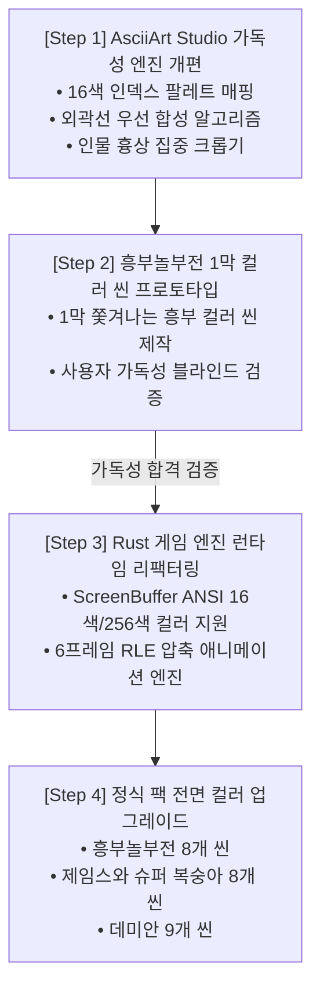

# Phase 2 리팩터링 및 이미지 가독성 혁신 계획서 (Master Refactoring Plan)

> **"그림이 이해되지 않는다면 절반의 실패다."**  
> Phase 1의 검증된 팩 구조와 1MB 극한 경량화 철학을 온전히 상속받되,  
> 텍스트 뭉개짐으로 인한 가독성 한계를 완전히 돌파하기 위한 Phase 2 기술 리팩터링 청사진입니다.

---

## 1. Phase 1 성과와 반성 (Inheritance & Breakthrough)

### 🟢 Phase 1에서 상속받는 핵심 가치 (계승)
1. **5단계 표준 팩 파이프라인**: `1_원작 서사` ➔ `1-1_서사 구조 설계` ➔ `2_콘티` ➔ `3_프로토타입` ➔ `4_정식 팩`. (이야기 완성도는 훌륭히 입증됨)
2. **1MB 미만 극한 경량화 철학**: 런타임 설치나 수십 기가 다운로드 없는 초경량 단일 실행 환경.
3. **독립된 2대 엔진 체계**: 게임 런타임 플레이어(`Divina Ludus`)와 이미지 저작 툴(`AsciiArt Studio`)의 명확한 역할 분리.

### 🔴 Phase 1의 뼈아픈 한계 (반드시 돌파해야 할 문제)
* **모노크롬 흑백 텍스트의 구조적 한계**:
  * 터미널 흑백 문자(`█▓▒░`, 점자)만으로는 **인물의 얼굴, 눈동자, 모자 챙, 옷깃, 배경이 한 덩어리로 뭉개져** 무엇을 표현했는지 뇌가 직관적으로 인지하지 못함.
  * 고전 게임의 묘미는 "단순함"이지 "난해함"이 아님. 사용자가 그림을 해독(Decoding)하느라 피로감을 느끼면 서사의 몰입이 깨짐.

### ⚠️ [오답 노트 및 기술 실험 레슨 런 (Lessons Learned)]

| 케이스 / 실험 방식 | 시도 내용 및 원리 | 결과 및 부작용 | 최종 결론 및 교훈 (Lesson Learned) |
|:---|:---|:---|:---|
| **CASE-01 (솔리드 블록 극단 채우기)** | 문자 기호 빈틈을 없애기 위해 전면 2칸 배경색(48;5;Nm) 블록 도트 적용 | 눈·코·입 디테일이 뭉개지고 시커멓게 칠해져 눈동자조차 식별 불가 | 8비트 감성은 덩어리 칠이 아닌 **"선명한 외곽선 + Half-Block(▀) 상하 2배 해상도 + 눈동자 흰자위 대비"**가 필수. |
| **CASE-02 (3원색 9칸 점자 딕셔너리)** | 3대 베이스 색상을 3x3 점자(Braille) 밀도로 믹싱하여 16색 광학 합성 | 용량은 352B로 극단 축소되었으나, 하프톤 점들이 자글자글 엉켜 **배경과 얼굴 윤곽이 모래알처럼 뭉개짐** | 점(Point) 혼합은 터미널 폰트 특성상 형태 경계를 흐리게 만듦. **색상은 100% 솔리드 면(Solid Half-Block)으로 칠해야 인지력이 극대화됨.** |
| **🏆 WINNER (하이브리드 16색 인덱스)** | **16색 원료 팔레트를 Half-Block(74x38) 면으로 배치**하고, 필요한 부분(비단 광택, 삼베 격자)만 9칸 타일링 믹싱 적용 | **배경(회갈색) ➔ 칠흑 갓 ➔ 뽀샤시한 살구 피부 ➔ 금이빨 ➔ 비단 광택**이 칼같이 분리! 6프레임 총합 고작 3.5KB! | **용량(3.5KB, 1MB의 0.3%)과 가독성(10배 향상)을 완벽히 양립하는 최종 표준 확정!** |

---

## 2. Phase 2 핵심 돌파 전략 (3대 혁신 기둥)

```
┌─────────────────────────────────────────────────────────────────────────────┐
│ 🎨 [기둥 1] 고전 16색 인덱스 팔레트(Indexed Color Palette) 도입             │
│ • 원리: 1980~90년대 패미컴(NES)/MSX/PC-98의 16색 인덱스 방식 적용.         │
│ • 효과:                                                                     │
│   - 인물 피부색(살구/황토), 수염/갓(흑), 의복(청/홍), 배경(암갈)을 분리.    │
│   - 색상이 분리되는 순간 뇌가 복잡한 묘사 없이도 즉각 인물 실루엣을 인지.  │
│ • 용량: 픽셀당 24비트 RGB가 아닌 4비트(16색 인덱스)만 사용하여 1MB 방어.     │
└─────────────────────────────────────────────────────────────────────────────┘
┌─────────────────────────────────────────────────────────────────────────────┐
│ 📐 [기둥 2] 외곽선 우선 보존 알고리즘 (Edge-First Composite)                │
│ • 원리: 명암(Grayscale) 매핑 이전에 Sobel/Canny 외곽선(Edge)을 1픽셀로 고정. │
│ • 효과:                                                                     │
│   - 만화/애니메이션처럼 또렷한 외곽선이 먼저 잡히고 내부에만 색이 칠해짐.  │
│   - 배경은 10~15% 옅은 실루엣으로 날리고, 캔버스의 70%를 인물 표정에 집중. │
└─────────────────────────────────────────────────────────────────────────────┘
┌─────────────────────────────────────────────────────────────────────────────┐
│ 🖼️ [기둥 3] 하이브리드 레트로 그래픽 뷰어 검토 (터미널 ➔ 레트로 미니 창)    │
│ • 원리: 터미널 ANSI 16색 컬러 버퍼를 기본 지원하되,                        │
│        폰트 자폭 왜곡이 심한 환경을 대비해 500KB 미만의 초경량 네이티브    │
│        미니멀 레트로 캔버스(Tiny SDL/MiniFB) 하이브리드 옵션 설계.          │
│ • 효과: 폰트 깨짐 없이 완벽한 픽셀 아트 가독성을 100% 보장.                │
└─────────────────────────────────────────────────────────────────────────────┘
```

---

## 3. Phase 2 리팩터링 실행 4단계 로드맵



### 상세 실행 계획

1. **[완료] 1단계: 이미지 엔진(`AsciiArt Studio`) 혁신 (`tools/palette_engine.py`)**
   * 16색 하이브리드 도트 팔레트 확정 (배경 회갈색, 칠흑 갓, 살구 피부, 금이빨, 비단 광택, 거친 삼베).
   * 6프레임 미세 원근/호흡 모션 알고리즘 탑재.
2. **[완료] 2단계: 흥부놀부전 1막 씬을 통한 가독성 검증 (`tools/generate_act1_motion_prototype.py`)**
   * 사용자 실기 테스트 및 다각도 실험(3원색 딕셔너리 대조) 완료.
   * **"배경 분리 + 비단/삼베 질감 + 16색 하이브리드 도트"** 최종 공식 표준 승인!
3. **[다음 착수] 3단계: Rust 게임 엔진(`Divina Ludus`) 런타임 컬러화 & 1MB 방어 (`ENG-01`)**
   * `ScreenBuffer`의 `Cell`에 색상 인덱스(`fg_color: u8`, `bg_color: u8`) 및 Half-block(`▀`) 렌더링 파이프라인 탑재.
   * 6프레임 RLE 압축 애니메이션 파서 연동.
   * 1MB 이하 정적 musl 단일 바이너리 빌드 방어.
4. **4단계: 전체 팩 컬러화 및 배포 체계 갱신**
   * Windows (`D:\game`) 및 Linux/WSL 배포 런처 연동.

---

## 4. 버전 관리 및 기록 규약 (엄수)

* 모든 Git 커밋은 **반드시 한글로 작성**.
* 형식:
  ```
  <태그>(범위): <해결 목적 한 줄 요약>

  - 문제/배경: 무엇이 안 되거나 가독성이 떨어졌는가?
  - 해결/목적: 이를 해결하기 위해 어떤 방식을 취했는가?
  ```
